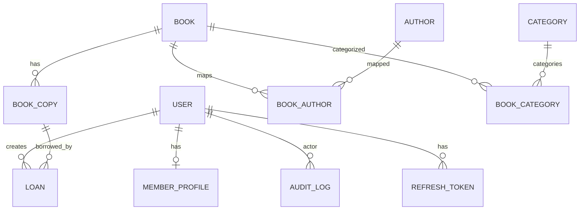

# Library Management System — ERD

This document defines a normalized (3NF) relational design for the LMS aligned to the PRD. It includes entities, relationships, constraints, and performance indexes. Types are PostgreSQL-friendly and use uuid primary keys and timestamptz timestamps.

## Mermaid ER Diagram



Legend: `||` = exactly one, `o|` = zero or one, `o{` = zero or many.

## Entities

Columns list PostgreSQL types, PK/FK, uniques, and defaults. All tables include `created_at timestamptz DEFAULT now()` and `updated_at timestamptz DEFAULT now()` unless stated otherwise.

### user

- id uuid PRIMARY KEY DEFAULT gen_random_uuid()
- email text NOT NULL UNIQUE  — unique user login (validated lower-cased in app)
- password_hash text NOT NULL
- role role_enum NOT NULL DEFAULT 'MEMBER'
- is_active boolean NOT NULL DEFAULT true
- last_login_at timestamptz NULL
- created_at timestamptz NOT NULL DEFAULT now()
- updated_at timestamptz NOT NULL DEFAULT now()

### member_profile (1:1 with user)

- id uuid PRIMARY KEY DEFAULT gen_random_uuid()
- user_id uuid NOT NULL UNIQUE REFERENCES user(id) ON DELETE CASCADE
- first_name text NOT NULL
- last_name text NOT NULL
- phone text NULL
- address text NULL
- status membership_status_enum NOT NULL DEFAULT 'ACTIVE'
- notes text NULL
- created_at timestamptz NOT NULL DEFAULT now()
- updated_at timestamptz NOT NULL DEFAULT now()

### author

- id uuid PRIMARY KEY DEFAULT gen_random_uuid()
- name text NOT NULL UNIQUE
- bio text NULL
- created_at timestamptz NOT NULL DEFAULT now()
- updated_at timestamptz NOT NULL DEFAULT now()

### category

- id uuid PRIMARY KEY DEFAULT gen_random_uuid()
- name text NOT NULL UNIQUE
- description text NULL
- created_at timestamptz NOT NULL DEFAULT now()
- updated_at timestamptz NOT NULL DEFAULT now()

### book

- id uuid PRIMARY KEY DEFAULT gen_random_uuid()
- title text NOT NULL
- subtitle text NULL
- description text NULL
- isbn text NOT NULL UNIQUE
- publication_year smallint NULL
- language text NULL
- cover_image_url text NULL
- status book_status_enum NOT NULL DEFAULT 'ACTIVE'
- created_at timestamptz NOT NULL DEFAULT now()
- updated_at timestamptz NOT NULL DEFAULT now()

### book_author (junction)

- book_id uuid NOT NULL REFERENCES book(id) ON DELETE CASCADE
- author_id uuid NOT NULL REFERENCES author(id) ON DELETE CASCADE
- PRIMARY KEY (book_id, author_id)

### book_category (junction)

- book_id uuid NOT NULL REFERENCES book(id) ON DELETE CASCADE
- category_id uuid NOT NULL REFERENCES category(id) ON DELETE CASCADE
- PRIMARY KEY (book_id, category_id)

### book_copy

- id uuid PRIMARY KEY DEFAULT gen_random_uuid()
- book_id uuid NOT NULL REFERENCES book(id) ON DELETE RESTRICT
- code text NOT NULL UNIQUE  — inventory/barcode or generated code
- status copy_status_enum NOT NULL DEFAULT 'AVAILABLE'
- location_code text NULL
- created_at timestamptz NOT NULL DEFAULT now()
- updated_at timestamptz NOT NULL DEFAULT now()

### loan

- id uuid PRIMARY KEY DEFAULT gen_random_uuid()
- user_id uuid NOT NULL REFERENCES user(id) ON DELETE RESTRICT
- book_id uuid NOT NULL REFERENCES book(id) ON DELETE RESTRICT
- copy_id uuid NOT NULL REFERENCES book_copy(id) ON DELETE RESTRICT
- status loan_status_enum NOT NULL DEFAULT 'REQUESTED'
- borrowed_at timestamptz NULL
- due_date timestamptz NULL
- returned_at timestamptz NULL
- renewal_count integer NOT NULL DEFAULT 0
- penalty_accrued numeric(12,2) NOT NULL DEFAULT 0
- created_at timestamptz NOT NULL DEFAULT now()
- updated_at timestamptz NOT NULL DEFAULT now()

### setting (singleton rows)

- id uuid PRIMARY KEY DEFAULT gen_random_uuid()
- approvals_required boolean NOT NULL DEFAULT true
- loan_days integer NOT NULL DEFAULT 14
- renewal_days integer NOT NULL DEFAULT 7
- renewal_min_days_before_due integer NOT NULL DEFAULT 1
- max_renewals integer NOT NULL DEFAULT 1
- overdue_fee_per_day numeric(12,2) NOT NULL DEFAULT 1000
- overdue_fee_cap_per_loan numeric(12,2) NOT NULL DEFAULT 1000000
- currency currency_enum NOT NULL DEFAULT 'IDR'
- max_concurrent_loans integer NOT NULL DEFAULT 5
- notifications_enabled boolean NOT NULL DEFAULT true
- due_soon_days integer NOT NULL DEFAULT 3
- due_date_notifications_enabled boolean NOT NULL DEFAULT true
- from_email text NOT NULL DEFAULT 'admin-library@mail.com'
- smtp_provider smtp_provider_enum NOT NULL DEFAULT 'MAILTRAP'
- send_hour_UTC integer NOT NULL DEFAULT 8
- time_zone text NOT NULL DEFAULT 'UTC'
- created_at timestamptz NOT NULL DEFAULT now()
- updated_at timestamptz NOT NULL DEFAULT now()

### audit_log

- id uuid PRIMARY KEY DEFAULT gen_random_uuid()
- user_id uuid NULL REFERENCES user(id) ON DELETE SET NULL  — actor (nullable)
- action text NOT NULL  — string enum in app
- entity_type text NOT NULL
- entity_id uuid NOT NULL
- metadata jsonb NOT NULL DEFAULT '{}'::jsonb
- created_at timestamptz NOT NULL DEFAULT now()

### refresh_token

- id uuid PRIMARY KEY DEFAULT gen_random_uuid()
- user_id uuid NOT NULL REFERENCES user(id) ON DELETE CASCADE
- token text NOT NULL UNIQUE  — hashed refresh token
- expires_at timestamptz NOT NULL
- is_revoked boolean NOT NULL DEFAULT false
- created_at timestamptz NOT NULL DEFAULT now()
- updated_at timestamptz NOT NULL DEFAULT now()

## Relationships

- user 1:1 member_profile (unique FK on member_profile.user_id). Deleting a user cascades to its member_profile, but is RESTRICTED by existing loans.
- user 1:N loan (user_id)
- user 1:N audit_log (user_id)
- user 1:N refresh_token (user_id, CASCADE on delete)
- book 1:N book_copy (RESTRICT delete when copies exist)
- book M:N author via book_author
- book M:N category via book_category
- book_copy 1:N loan

Deletion/archival policy:
- Entities with historical references are not hard-deleted: books with copies/loans → set book.status='ARCHIVED'. FKs on loans and copies use RESTRICT to prevent destructive deletes.

## Constraints & Indexes

### Uniques

- user.email UNIQUE
- book.isbn UNIQUE
- author.name UNIQUE
- category.name UNIQUE
- book_copy.code UNIQUE

### Foreign keys and onDelete

- loan.user_id → user(id) ON DELETE RESTRICT
- loan.book_id → book(id) ON DELETE RESTRICT
- loan.copy_id → book_copy(id) ON DELETE RESTRICT
- book_copy.book_id → book(id) ON DELETE RESTRICT
- Junctions (book_author, book_category) use ON DELETE CASCADE for cleanup when a book/author/category is removed (no historical refs tracked there)

### Business rules (DB-enforced)

- One open loan per copy (approved/active/overdue):
```sql
CREATE UNIQUE INDEX ux_loans_one_open_per_copy
  ON loan (copy_id)
  WHERE status IN ('APPROVED','ACTIVE','OVERDUE');
```
- Single-loan renewal tracked in loan.renewal_count (application ensures <= max_renewals from settings)

### Additional indexes for refresh tokens

```sql
-- Refresh token lookups
CREATE INDEX IF NOT EXISTS idx_refresh_token_user ON refresh_token (user_id);
CREATE INDEX IF NOT EXISTS idx_refresh_token_expires ON refresh_token (expires_at);
CREATE UNIQUE INDEX IF NOT EXISTS idx_refresh_token_token ON refresh_token (token);
```

### Search and filtering indexes

- Enable fast title/author search (choose one or both):
```sql
-- Trigram (ILIKE) — requires: CREATE EXTENSION IF NOT EXISTS pg_trgm;
CREATE INDEX IF NOT EXISTS idx_books_title_trgm ON book USING gin (title gin_trgm_ops);
CREATE INDEX IF NOT EXISTS idx_authors_name_trgm ON author USING gin (name gin_trgm_ops);

-- Full-text search on books
ALTER TABLE book
  ADD COLUMN IF NOT EXISTS search_tsv tsvector GENERATED ALWAYS AS (
    setweight(to_tsvector('simple', coalesce(title,'')), 'A') ||
    setweight(to_tsvector('simple', coalesce(subtitle,'')), 'B') ||
    setweight(to_tsvector('simple', coalesce(description,'')), 'C')
  ) STORED;
CREATE INDEX IF NOT EXISTS idx_books_search_tsv ON book USING gin (search_tsv);
```

- Filtering/pagination:
```sql
-- Common FKs
CREATE INDEX IF NOT EXISTS idx_copy_book ON book_copy (book_id);
CREATE INDEX IF NOT EXISTS idx_loan_user ON loan (user_id);
CREATE INDEX IF NOT EXISTS idx_loan_book ON loan (book_id);
CREATE INDEX IF NOT EXISTS idx_loan_copy ON loan (copy_id);

-- Loan dashboards
CREATE INDEX IF NOT EXISTS idx_loan_status_due ON loan (status, due_date);
CREATE INDEX IF NOT EXISTS idx_loan_due_date ON loan (due_date);

-- Catalog filters
CREATE INDEX IF NOT EXISTS idx_book_category_cat ON book_category (category_id, book_id);
CREATE INDEX IF NOT EXISTS idx_book_author_auth ON book_author (author_id, book_id);

-- Pagination helpers
CREATE INDEX IF NOT EXISTS idx_books_created_at ON book (created_at, id);
CREATE INDEX IF NOT EXISTS idx_loans_created_at ON loan (created_at, id);
```

## Enums

```sql
-- Core enumerations
CREATE TYPE role_enum AS ENUM ('ADMIN','MEMBER');
CREATE TYPE membership_status_enum AS ENUM ('PENDING','ACTIVE','SUSPENDED');
CREATE TYPE book_status_enum AS ENUM ('ACTIVE','ARCHIVED');
CREATE TYPE copy_status_enum AS ENUM ('AVAILABLE','ON_LOAN','LOST','DAMAGED');
CREATE TYPE loan_status_enum AS ENUM ('REQUESTED','APPROVED','ACTIVE','RETURNED','OVERDUE','REJECTED','CANCELLED');
CREATE TYPE currency_enum AS ENUM ('IDR');
CREATE TYPE smtp_provider_enum AS ENUM ('MAILTRAP');
```

## Assumptions

- IDs are UUIDs generated via `gen_random_uuid()`; application ensures single Settings row.
- Books with historical references are archived (status='ARCHIVED'); deletes are restricted by FKs.
- Availability is derived; BookCopy.status is authoritative; DB index prevents multiple open loans per copy.
- Authentication handled by Passport.js with JWT; password hashing (bcrypt) and email normalization occur in the app layer; refresh tokens stored for revocation capability.
- VIEW for available copies per book (used by catalog and detail pages):
```sql
CREATE OR REPLACE VIEW v_book_available_copies AS
SELECT b.id AS book_id,
       count(c.id) FILTER (
         WHERE c.status = 'AVAILABLE'
           AND NOT EXISTS (
             SELECT 1 FROM loan l
             WHERE l.copy_id = c.id AND l.status IN ('APPROVED','ACTIVE','OVERDUE')
           )
       ) AS available_copies,
       count(c.id) AS total_copies
FROM book b
LEFT JOIN book_copy c ON c.book_id = b.id
GROUP BY b.id;
```

